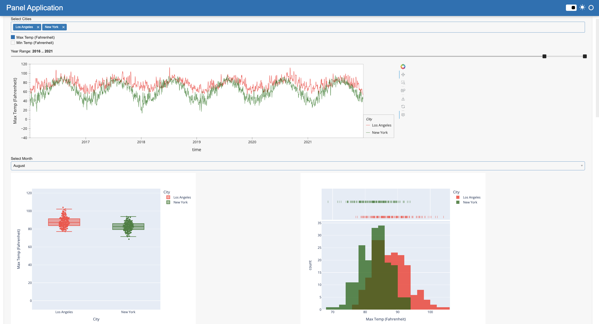
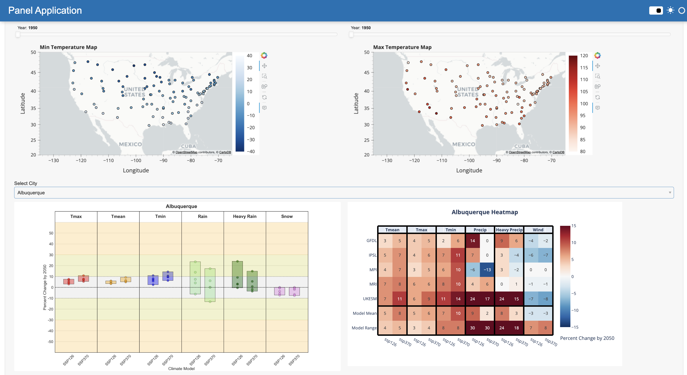

# Climate_Change_Dynamic_Visualizations
Created Several Interactive Data Visualizations for Environmental Power Research Institute (EPRI) Contract

## General Background 
Electric Power Research Institute (EPRI) is a leading research organization dedicated to advancing the reliable, affordable, and resilient future of energy. EPRI is known for its unbiased, science-driven approach, rigorously focusing on objective research to guide the energy industry without advocating for specific companies, sectors, or technologies. Their mission is to deliver independent thought leadership and practical insights that benefit society at large, empowering the energy sector through collaborative and data-driven solutions.

I am currently a Project Manager at DataStory, a data science consulting organization at UC Berkeley. Initially contracted as part of a semester-long consulting project, I transitioned from being a consultant/programmer to assuming a more central role as Project Manager toward the end of the engagement. This transition gave me the opportunity to not only contribute to the technical aspects of the project but also manage our team toward the end.

## Project Overview

The primary objective of this project was to leverage data analysis and visualization techniques to derive meaningful insights from complex energy-related datasets provided by EPRI. As a part of EPRI's mission to foster innovation in the energy industry, the datasets contained valuable information regarding energy usage patterns, weather data, and climate variables that could influence energy distribution and consumption.

The project's goals can be summarized as follows:
1. Data Cleaning and Preprocessing: The first step involved extracting relevant data from raw files and performing necessary transformations. This included:
- Handling missing or corrupt data entries.
- Aggregating data by time intervals (e.g., year, month) for better visualization.
- Converting energy and temperature units to standardized formats.

2. Interactive Visualizations: The next phase focused on creating dynamic, interactive visualizations to help EPRI's analysts as well as users on their webpage to explore the data more intuitively. Key visualizations included:
- Line charts showing temperature trends over time for different cities.
Box plots that presented temperature variations by month or year, highlighting extreme values.
- Histograms for the distribution of maximum and minimum temperatures.
- Map-based visualizations that utilized geographical data to map energy patterns against weather conditions.

## Tools and Technologies
- Jupyter Notebooks: The entire workflow was initially developed and tested in Jupyter notebooks, allowing for rapid prototyping and easy collaboration with the rest of the team.
- Python Libraries: For data manipulation, we relied on popular Python libraries such as Pandas for handling large datasets, Xarray for working with multidimensional arrays (e.g., temperature data), and NumPy for numerical calculations.
- Panel and Bokeh: These were the core libraries used for creating the interactive dashboard. Panel enabled the creation of dynamic, server-ready applications, while Bokeh provided robust plotting capabilities.
- Plotly: In addition to Bokeh, Plotly was used for more complex visualizations, such as the box plots and histograms, which benefited from Plotly’s flexible layout options.
- HoloViz: This provided high level tools to apply plotting libraries to data.
- hvPLot: This library quickly generated the interactive plots themselves.

## Data and Methodology
1. Data Sources
- Temperature Data
  - The dataset included daily maximum and minimum temperatures (tmax and tmin) across multiple cities, spanning several decades. This was essential to understanding how climate variables have impacted energy consumption over time.
  - netCDF file containing a multi-dimensional Xarray dataset
  - Indexed by time and City
  - Attributes: Date, city, latitude, longitude, min temp, max temp
- Modeled Weather/Temperature Data
  - This data set had future data (projecting to 2050)
  - netCDF file containing a multi-dimensional Xarray dataset
  - Attributes: Longitude, latitude, quantile, city, mean temp, max temp, min temp, precipitation, heavy precipitation, wind
  - Unique points for every combination of 5 different climate models and 2 climate protection measure scenarios
  - Models: GFDL, IPSL, MPI, MRI, UKESM
  - Scenarios: SSP126, SSP370
    - SSP: Shared Socioeconomic  Pathways

2. Data Cleaning and Processing
The raw data was structured into separate files and needed significant preprocessing. Below are some key steps in this process:
- Handling Missing Data: Certain regions had missing entries for both temperature and energy usage logs. We employed imputation techniques and interpolation to estimate missing values without compromising the data integrity.
- Data Aggregation: To simplify the analysis, we aggregated data on a monthly and yearly basis. This allowed us to identify long-term trends without getting lost in the noise of day-to-day fluctuations.
- Unit Conversion: Temperature data was originally recorded in Celsius, which we converted to Fahrenheit to better align with energy reports typically used in the U.S.

3. Visualization and Analysis
Bokeh and Panel were employed for creating interactive visualizations, allowing users to manipulate the data on the fly. The visualizations included:
- Temperature Line Plot: These charts illustrated temperature trends over time.
  - This plot made it easier to visualize the correlation between rising temperatures and increasing energy demands.
- Temperature Box Plots: This visualization allowed users to compare the maximum and minimum temperatures across cities and see how they varied by month or year.
  - The interactivity made it easy for users to filter cities and time periods and adjust the granularity of the data.
- Both of these plots had the 'Select City' Widget, a 'Min Temp / Max Temp' selector where the user can change the visualization based on a specific City and Min/Max Temp filter, and a 'Year Range' slider where the user could control the bounds of the visualization, allowing it to effectively zoom in or out along the x-axis. The Temperature Box Plots also had a 'Select Month' Widget in addition. 

- Geospatial Visualizations (Map Plots): Using geographical data (latitude and longitude), we built maps to overlay temperature data with energy usage, allowing EPRI stakeholders to explore regional variations in energy consumption.
  - For this plot, it displayed two maps based on Min or Max temperature in that area. There was a widget that affected both plots where the user can specify the year which would be anytime from 1950 to 2021. White represents colder while more color indicates warmer temperatures.
- Box Plot of Climate Variables by Model
  - This plot compares several climate variables (Tmax, Tmean, Tmin, Rain, Heavy Rain, Snow) for different climate models (SSP126 and SSP370).
  - Variables on the x-axis: Tmax (maximum temperature), Tmean (mean temperature), Tmin (minimum temperature), Rain (total rainfall), Heavy Rain (extreme rainfall), and Snow (snowfall).
  - Models on the x-axis: SSP126 and SSP370, which refer to different Shared Socioeconomic Pathways (scenarios that project future emissions and climate outcomes). These scenarios provide a range of potential future outcomes based on policy and emissions changes.
  - Percent Change on the y-axis: The y-axis represents the percent change in each variable by the year 2050 relative to a baseline. The zero line in the middle indicates no change, while values above and below the line show increases and decreases in that variable.
- Heatmap of Climate Changes by Model
  - Variables on the y-axis: The weather variables include Tmean (mean temperature), Tmax (maximum temperature), Tmin (minimum temperature), Precip (total precipitation), Heavy Precip (extreme precipitation), and Wind.
  - Climate Models on the y-axis: These include models like GFDL, IPSL, MPI, MRI, and UKESM, representing different climate simulations.
  - Scenarios on the x-axis: Again, you see SSP126 and SSP370, representing the two different emissions scenarios.
  - Color Scale: The color gradient represents percent changes by 2050, with red indicating an increase and blue indicating a decrease. The more intense the color, the greater the change. For example, deep red suggests a significant increase, and deep blue indicates a large decrease.
- For these two plots, there is a widget that allows you to select the city.

## Project Reflection
From a personal perspective, this project was not only a learning experience in terms of technical skills but also an opportunity to grow in a leadership role.
